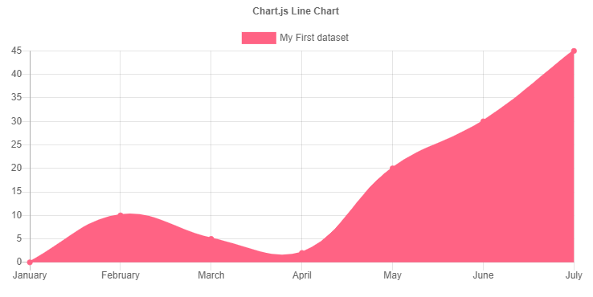
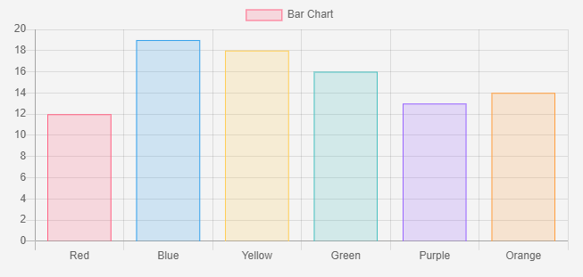

# hugo-chart

[](https://github.com/budparr/awesome-hugo)

## 简介

这是一个为 [Hugo](https://gohugo.io) 而写的 [Chart.js](https://www.chartjs.org/) 图表组件，用 `chart` 短代码就可以方便的把优雅的动态图表插入到你的 Hugo 站点中。



## 用法

1. 用 `git submodule add https://github.com/Shen-Yu/hugo-chart.git themes/hugo-chart` 命令把 hugo-chart 添加为项目的子模块。
2. 找到 Hugo 站点根目录下的配置文件（`config.yaml` 或 `config.toml`），把 `hugo-chart` 添加到 `theme` 选项的最左侧，以下是 `config.yaml`
    ```yaml
    theme: ["hugo-chart", "my-theme"]
    ```
    以下是 `config.toml` 
    ```toml
    theme = ["hugo-chart", "my-theme"]
    ```
3. 在你的站点文章或页面中，插入以下格式的短代码
    ```go
    
    // 这里是 Chartjs 的配置
    

    ```

    |  名称   | 类型  | 默认  | 描述  |
    |  ----  | ----  | ----  | ----  |
    | width  | decimal | 100% | 图表宽度，默认是响应式的  |
    | height  | number | 300 | 图表高度（px） |
    
4. 注意 Chartjs 默认是响应式的, 为了使自定义宽高生效, 你需要先把 `maintainAspectRatio` 选项设置成  `false` 。

## 例子

```go

{
    type: 'bar',
    data: {
        labels: ['Red', 'Blue', 'Yellow', 'Green', 'Purple', 'Orange'],
        datasets: [{
            label: 'Bar Chart',
            data: [12, 19, 18, 16, 13, 14],
            backgroundColor: [
                'rgba(255, 99, 132, 0.2)',
                'rgba(54, 162, 235, 0.2)',
                'rgba(255, 206, 86, 0.2)',
                'rgba(75, 192, 192, 0.2)',
                'rgba(153, 102, 255, 0.2)',
                'rgba(255, 159, 64, 0.2)'
            ],
            borderColor: [
                'rgba(255, 99, 132, 1)',
                'rgba(54, 162, 235, 1)',
                'rgba(255, 206, 86, 1)',
                'rgba(75, 192, 192, 1)',
                'rgba(153, 102, 255, 1)',
                'rgba(255, 159, 64, 1)'
            ],
            borderWidth: 1
        }]
    },
    options: {
        maintainAspectRatio: false,
        scales: {
            yAxes: [{
                ticks: {
                    beginAtZero: true
                }
            }]
        }
    }
}

```



## 开源协议

[hugo-chart](https://github.com/Shen-Yu/hugo-chart) by [Eric Shen](https://github.com/Shen-Yu) is under [GPL v3](https://github.com/Shen-Yu/hugo-chart/blob/master/LICENSE) license.
